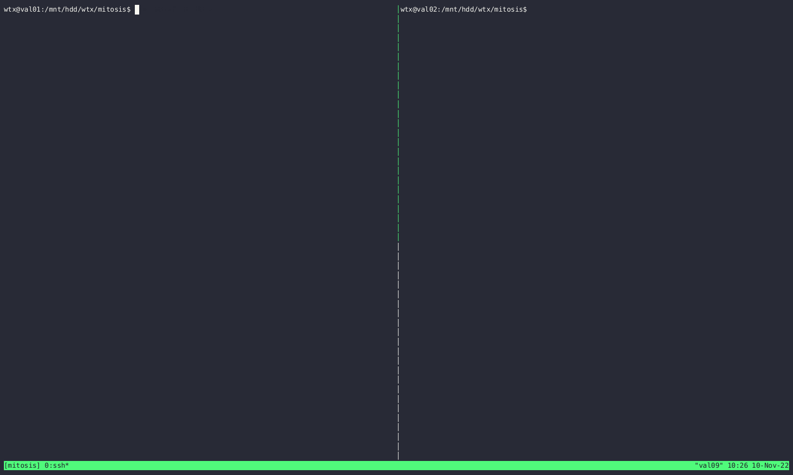

# MITOSIS: An OS primitive of fast remote fork

Mitosis is a kernel module that provides a new system primitive of fast remote fork based on RDMA.

## Getting Started Instructions

### Prerequisite

### 1. Software 

- OS: Ubuntu16.04 (throughly tested, in general is irrelevant to the OS)
- Linux kernel: 4.15.0-46-generic (porting needed to fit other OSes)
- MLNX_OFED driver: 4.9-3.1.5.0 (throughly, use our modified driver in case to support DCT)
- Rustc: 1.60.0-nightly (71226d717 2022-02-04)
- Clang-9

#### 2. Hardware 

- A machine with Mellanox RDMA-capable IB NIC (later than or equal to ConnectX-4). 
  - In principle there is no difficult in supporting RoCE, but we have lack such NIC for testing.  We welcome testing and porting on other RNICs. 
- X86-64 servers 

Please refer to the document [here](./docs/setup.md) for how to configure software environments.

---

### Compile the mitosis

Assumptions: we have finished installing the software dependencies described in the Prerequisite. 

```bash
make km ## building the kernel module
file mitosis-kms/fork.ko
# mitosis-kms/fork.ko: ELF 64-bit LSB relocatable, x86-64, version 1 (SYSV), BuildID[sha1]=xxx, not stripped
```

Mitosis has different configurations, including:

    - Prefetch: Read ahead some pages with RDMA
    - Page cache: Cache some pages locally instead of read through RDMA
    - COW: Use Copy-On-Write instead of directly copying page content
    - Eager resume: Read all the pages during the startup
    - Profile: Print performance profile during the execution
These configurations are specified in the `mitosis-kms/Kbuild` file with Rust features. Without further explanation, we will use the default configuration "COW+Prefetch". If you want to use other configurations, you can copy the Kbuild file before the compilation.

```bash
ls mitosis-kms/Kbuild* # will show the available Kbuild configurations
cp mitosis-kms/Kbuild-mitosis-prefetch mitosis-kms/Kbuild
```

### Example 

We have provided a simple demo on how to use the kernel module to remote fork a process.

1. Choose two machines, one as the parent machine and one as the child machine. Get the gid (RDMA address) of the parent machine.

```bash
show_gids
# DEV     PORT    INDEX   GID                                     IPv4            VER     DEV
# ---     ----    -----   ---                                     ------------    ---     ---
# mlx5_0  1       0       fe80:0000:0000:0000:ec0d:9a03:00ca:2f4c                 v1
# mlx5_1  1       0       fe80:0000:0000:0000:ec0d:9a03:0078:6376                 v1
# n_gids_found=2
```

Mitosis uses the first RDMA nic by default, so we will use the gid `fe80:0000:0000:0000:ec0d:9a03:00ca:2f4c` here.

2. Prepare the demo C++ programs on both machines.

```bash
cd exp
cmake .
make connector `## the utility program to connect mitosis kernel-space rpc, source code: exp/common/connector.cc` \
     simple_parent `## a simple parent program, which prints a number every second, source code: exp/common/simple_parent.cc` \
     simple_child `## a simple child program, which is to fork the parent program from a remote machine, source code: exp/common/simple_child.cc`
```

```c++
// an excerpt of exp/common/simple_parent.cc
int
main(int argc, char *argv[]) {
    // omitted
    int sd = sopen(); // open the mitosis device in /dev
    int cnt = 0;
    assert(sd != 0);

    sleep(1);
    printf("time %d\n", cnt++);
    fork_prepare(sd, FLAGS_handler_id); // call the fork_prepare with id here
    // the child program will resume the execution from this point

    while (1) {
        printf("time %d\n", cnt++);
        sleep(1);
    }
}

// an excerpt of exp/common/simple_child.cc
int
main(int argc, char *argv[]) {
    // omitted
    int sd = sopen();
    assert(sd != 0);
    // the child program call the fork_resume to resume the execution from the parent program with `handler_id` on machine `mac_id`
    fork_resume_remote(sd, FLAGS_mac_id, FLAGS_handler_id);
    assert(false); // we should never reach this point
    return 0;
}
```

3. Compile and insert the kernel module on **both** machines.

```bash
# at each machine, run the following command: 
make km && make insmod
file /dev/mitosis-syscalls
# /dev/mitosis-syscalls: setuid, setgid, sticky, character special (238/0)
```

4. Run the connector on the child machine to let the child machine to connect to the parent machine.

```bash
cd exp
./connector -gid="fe80:0000:0000:0000:ec0d:9a03:00ca:2f4c" -mac_id=0 -nic_id=0 # this gid is marked as the nic 0 on the machine 0 on the child machine, and we will send connect request to it
```

5. Run the parent program on the parent machine.

```bash
cd exp
./simple_parent -pin=false -handler_id=73 # the parent program will print an increasing counter from 0 repeatedly
# the remote fork identification for the parent program is 73 and we choose to leave the program in the foreground and do not pin it in the kernel
```

6. Run the client program on the client machine

```bash
cd exp
./simple_child -mac_id=0 -handler_id=73 # the child will start printing the counter from 1 as if it has forked the parent program on machine 0 (val01) with id 73 from the point before it starts print the counter 1
```

7. Use Ctrl+C to kill the parent and child and use `make rmmod` to uninstall the kernel module.

#### An animated example is shown below to illustrate how to fork the parent at machine val01 to machine val02.

Note: We will try to remove the kernel module before we insert it, so as to avoid double insertion of the module. This will cause error like "Module is not loaded" when the module is not inserted before. This error is OK.



## Testing and Benchmarking

We have provided unit tests, stress tests, and benchmarks for mitosis. Please refer to the documents [here](./docs/tests-and-benchmarks.md).

## Roadmap 

MITOSIS is still under development and code refactory, which current codebase has the following limitations:

1. We don't support multi-threading program. 
2. We only support child communicating with the server via RDMA DCT.
3. We don't support fallback handler,which is still under refactor. 
4. We assume the swap is disabled on the parent machine. 

Detailed roadmap: 

- [ ] Supporting languages with GC and multi-threading
- [ ] Fallback handler to support unmapped page 
- [ ] Add Reliable connection, RPC and TCP as an alternative to RDMA DCT-based network communications
- [ ] Other unfinished features/code refinement
    - [ ] RPC disconnection and elegant error handling in session creation
    - [ ] Doorbell optimization in prefetcher module

## Contribution

Want to contribute to mitosis? We have some unfinished designs and implementations. Please refer to the documents [here](docs/contribution/README.md).

## Related Projects

- [KRCORE](https://ipads.se.sjtu.edu.cn:1312/distributed-rdma-serverless/kernel-rdma/rust-kernel-rdma/-/tree/master/) is a rust RDMA library for user-space and kernel-space applications. 

## License
This project is licensed under the MIT license.

## Credits 

Some code is insipired by (or directly borrowed) from

- [nix](https://docs.rs/nix/latest/nix/)
- [tokio](https://tokio.rs)

We have to borrow some code because they don't support kernel space. 
