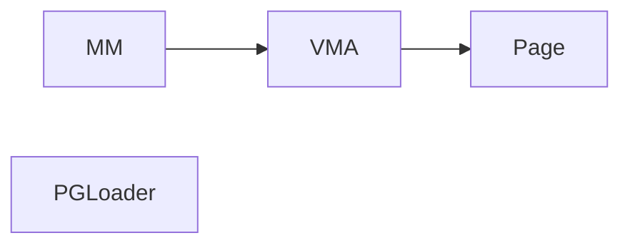

# A documentation of MITOSIS core 

## 1. Kernel wrappers 

First of all, we need to wrap the kernel the kernel's basic data structure into rust 

PGLoader: load a page table into the forked contasiner 
- **Note**: we should carefully evaluate whether pre-loading is faster, or we just do it during the runtime. 

## 2. Kernel extensions 

The kernel extension includes:

1. change the `page_fault_handler` to  identify the `remote bit `. We currently utilize xx bit as the remote bit. 
2. change the kernel stack size to a larger number to prevent frequent stack overflow of rust binaries. 

## 3. Container related 

User-space libraries to provide lean container, similar to runC. 

**TODO**: @TianXia, please fill this 

## 4. Systemcall wrappers

C-library to provide a systemcall interfaces. Currently, we only need to support two wrappers:

- Python wrapper -> In order to support evaluations 
- C wrapper -> for basic tests 

The *C wrapper* is preferred for the test. 

