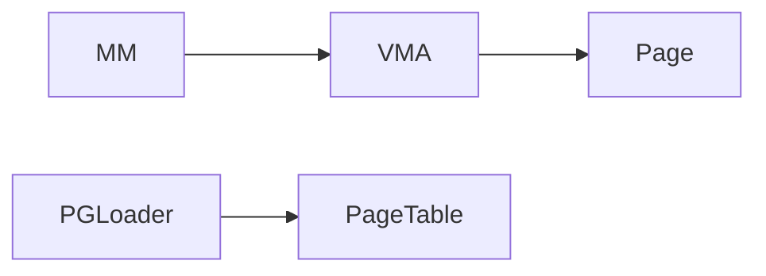
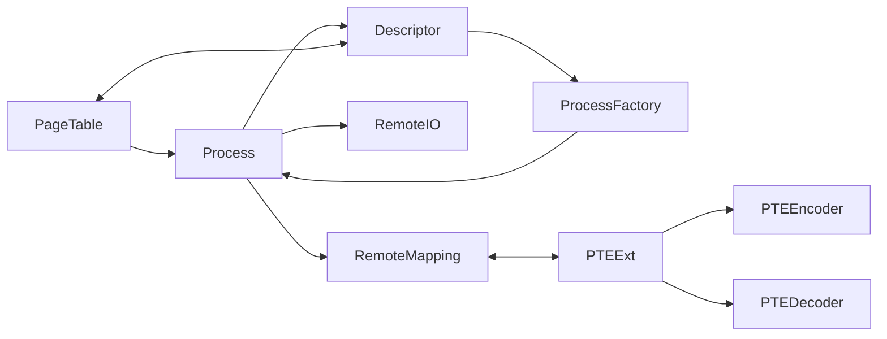
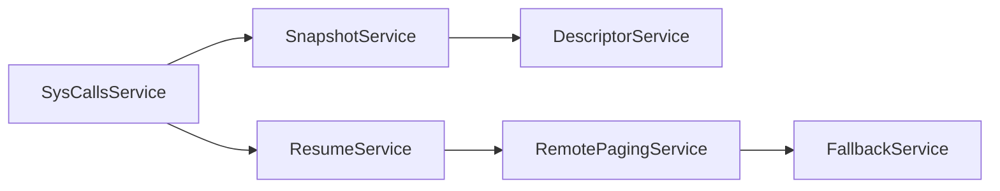

# A documentation of MITOSIS core 

## 1. Kernel wrappers 

First of all, we need to wrap the kernel the kernel's basic data structure into rust 

PGLoader: load a page table into the forked contasiner 
- **Note**: we should carefully evaluate whether pre-loading is faster, or we just do it during the runtime. 

## 2. Kernel extensions 

The kernel extension includes:

1. change the `page_fault_handler` to  identify the `remote bit `. We currently utilize xx bit as the remote bit. 
2. change the kernel stack size to a larger number to prevent frequent stack overflow of rust binaries. 

## 3. Container related 

Container = process + protections & isolations. MITOSIS kernel only handles the process fork, while the isolations and protections (e.g., `cgroup` and `namesapces` )are set by the user-space shim layer. 

### 3.1 User-space data structures

User-space libraries to provide lean container, similar to runC. 

**TODO**: @TianXia, please add these

- **Container** to fork from others: we can call it `InfraContainer` (inspired by [K8S](https://jimmysong.io/kubernetes-handbook/concepts/pause-container.html))

  

### 3.2 Kernel Space Data structures (Services)

**Process**: the overall process data abstraction in MITOSIS

**IO**: module to handle remote IOs 

**RemoteMapping**: the pre-decessors machine IDs 

**SnapshotService**: data structure to prepare the descriptor 

**ResumeService**: module to retore friom the descriptor

**DescriptorService**: data structure that store the prepared descriptors 

**FallbackService**: fallback daemon. 

**RemotePagingService**: a wrapper over remote memory devices.

**SysCallsService**: module to handle system calls 

## 4. Systemcall wrappers

C-library to provide a systemcall interfaces. Currently, we only need to support two wrappers:

- Python wrapper -> In order to support evaluations 
- C wrapper -> for basic tests 

The *C wrapper* is preferred for the test. 

