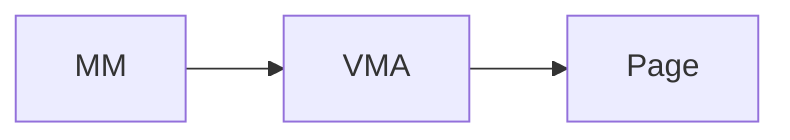

# A documentation of MITOSIS core 

## 1. Kernel wrappers 

First of all, we need to wrap the kernel the kernel's basic data structure into rust 

## 2. Kernel extensions 

The kernel extension includes:

1. change the `page_fault_handler` to  identify the `remote bit `. We currently utilize xx bit as the remote bit. 
2. change the kernel stack size to a larger number to prevent frequent stack overflow of rust binaries. 

## 3. Container related 

