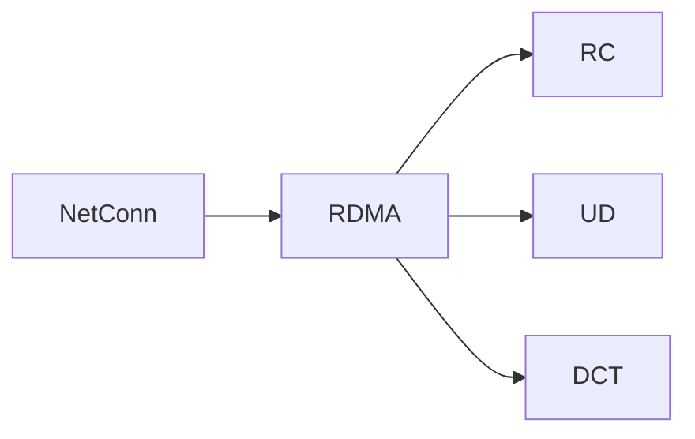
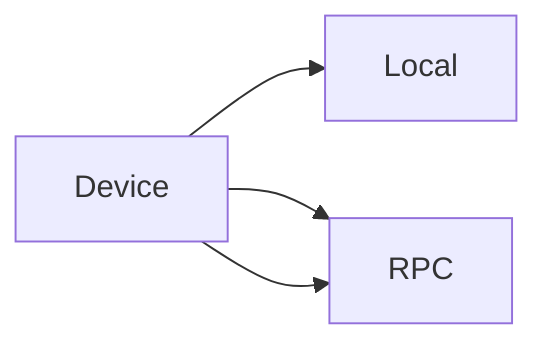

### A short documentation of the network daemon

### Module graphs

#### Network connection

```mermaid
flowchart LR
A[NetConn] --> B[RDMA]
B-->C[RC]
B-->D[UD]
B-->E[DCT]
```

#### Remote memory

```mermaid
flowchart LR
A[Device]
A-->B[Local]
A-->C[RDMA]
A-->C[RPC] 
```

We may not implement the RPC device, if the time does not permit. 

